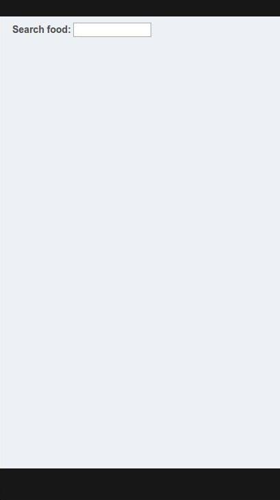
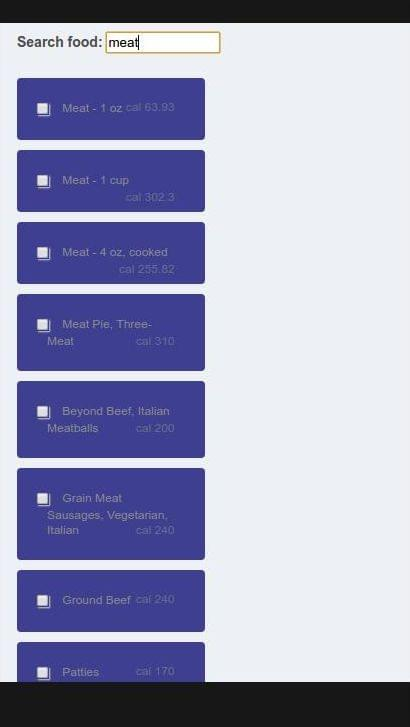
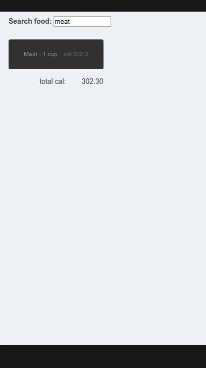
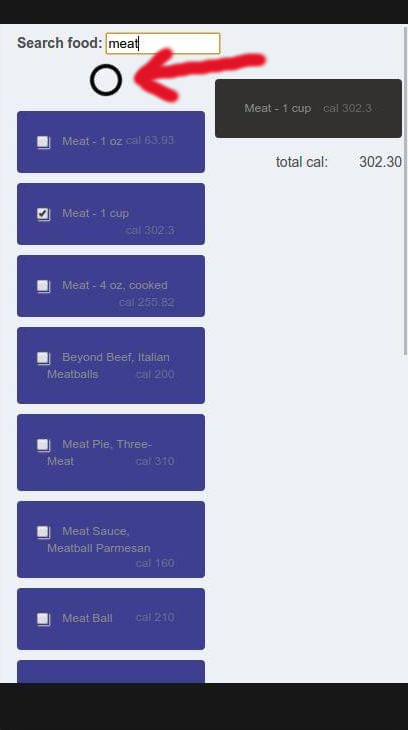
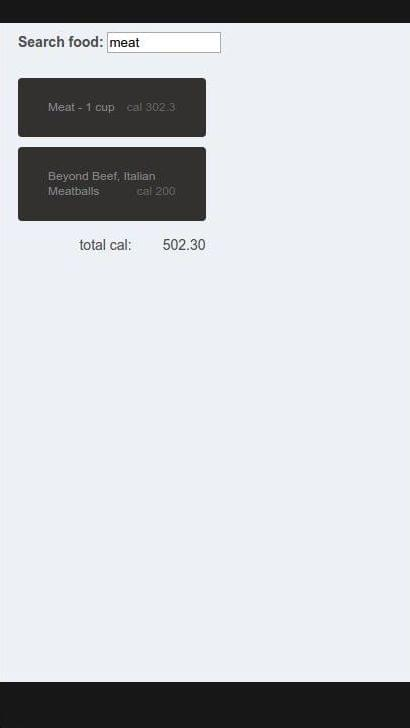
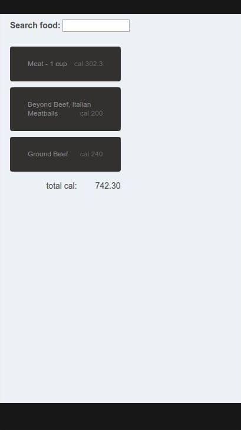
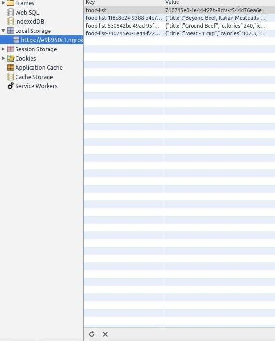
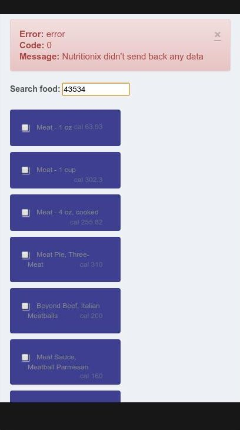

Nutritionix Project {Backbone Nutritionix Project}
===============================
The **Nutritionix Project** through the Backbone framework builds a website to list the foods calories. Starting with a search bar the user can search for foods and select from the resulting list the elements wanted. The selected element has added to the user list of foods (this list as stored in local browser memory so the user can close and open the browser with the list saved) and at the bottom of the list the total calories of the list are showed. All the informations on foods and calories come from the [Nutritionix (Nutrition Database)](http://www.nutritionix.com/business/api/).

Notes:
===============================
The **Nutritionix Project** the food search has done through an ajax call to the Nutrition Database the error has handled, in this case a message as showed on the top explaining the problem. The user has to close the message window pressing the x button. After starting the search, if it's all ok, in return appears a foods list and the user can choose the food he wants to add to the own list of foods. After the selection the user list takes the place of the search list and shows all the foods stored till now with the related calories.

Download:
===============================
`$ git clone https://github.com/svankj/backbone-nutritionix-project.git`

How to run the webapp:
===============================
Launch the web server, or similar, `SimpleHTTPServer` (e.g. `python -m SimpleHTTPServer 8000`) from terminal opened in the directory `backbone-nutritionix-project/dist/`. In the same directory from another terminal digit `.ngrok http 8000`. Copy the https url generated and paste it in the browser (e.g. `Chrome`).

Dev Tools:
===============================
The projetc has been developed using:
*	*OS Ubuntu 14.04 LTS* (*Trusty Tahr*)
*	Browser *Chromium*/*Chrome*
*	*Sublime Text*
*	*Haroopad* to write the documentation README.md file

Folders:
*	In the `/src/` directory there is the readable code, in the `/dist/` directory the minimized code.
*	`/src/` contains:
	* 	`css/style.css` the css file readable
	* 	`js/app.js` the application JS readable
	* 	`js/collections/nutritionixcollection.js` the Collection JS readable
	* 	`js/models/nutritionixmodel.js` the Model JS readable
	* 	`js/views/nutritionixview.js` the View JS readable
	* 	`index.html` the readable HTML file
*	`/dist/` contains:
	* 	`css/style.css` the css file minimized
	* 	`js/app.js` the application JS minimized
	* 	`js/collections/nutritionixcollection.js` the Collection JS minimized
	* 	`js/models/nutritionixmodel.js` the Model JS minimized
	* 	`js/views/nutritionixview.js` the View JS minimized
	* 	`index.html` the minimized HTML file
*	main directory contains:
	*	`README.md` the README file, documentation file
	*	`/doc/` images for README file
	*	`/dist/` directory
	*	`/src/` directory

Nutritionix Guide
===============================
 `Screencaps` | `Notes`
--- | ---
 | At the beginning there is only a search feature. The user can digit e.g. *meat*, *apple*, or some other kind of food and then press enter.
 | On the left appears a list of results showing a food name and related calories. Selecting/checking one of the results...
 | as requested by specifications the options list disappears and the user list of food chosen takes place showing the foods selected till now with the total amount of calories.
 | Search feature is very fast but as requested a loading animation has showed.
 | The user list of foods grows as the user adds new foods...
 | ...
 | The user list of foods is stored on local browser memory, so the open/close of the browser doesn't delete the list.
 | Error Handling.

License
===============================
>MIT License

>Copyright (c) 2016 svankj

>Permission is hereby granted, free of charge, to any person obtaining a copy
of this software and associated documentation files (the "Software"), to deal
in the Software without restriction, including without limitation the rights
to use, copy, modify, merge, publish, distribute, sublicense, and/or sell
copies of the Software, and to permit persons to whom the Software is
furnished to do so, subject to the following conditions:

>The above copyright notice and this permission notice shall be included in all
copies or substantial portions of the Software.

>THE SOFTWARE IS PROVIDED "AS IS", WITHOUT WARRANTY OF ANY KIND, EXPRESS OR
IMPLIED, INCLUDING BUT NOT LIMITED TO THE WARRANTIES OF MERCHANTABILITY,
FITNESS FOR A PARTICULAR PURPOSE AND NONINFRINGEMENT. IN NO EVENT SHALL THE
AUTHORS OR COPYRIGHT HOLDERS BE LIABLE FOR ANY CLAIM, DAMAGES OR OTHER
LIABILITY, WHETHER IN AN ACTION OF CONTRACT, TORT OR OTHERWISE, ARISING FROM,
OUT OF OR IN CONNECTION WITH THE SOFTWARE OR THE USE OR OTHER DEALINGS IN THE
SOFTWARE.

About me
===============================
 | `svanky is a Freelance Developer`
--- | ---
 	|